# RetinaNet Face Mask Detection


使用 **RetinaNet + ResNet50 + FPN** 實作口罩配戴狀態偵測。資料集採 VOC 格式，支援訓練、單張圖片推論、影片/攝影機推論、批次推論、mAP 評估與 Gradio 互動式 demo。

> **TL;DR (English):** Face mask detection with RetinaNet (ResNet50 + FPN) in TensorFlow/Keras, trained on the Kaggle Face Mask Detection dataset (3 classes, mAP@0.5 = 76.05%). Ships with config-driven CLI tools for training, inference, and mAP evaluation, plus error-analysis scripts, CI smoke tests, and a Gradio demo.

## 專案亮點

- 以 RetinaNet 的 Focal Loss 處理嚴重類別不平衡問題
- 支援 VOC 格式資料集切分與標註轉換
- 提供 CLI 化的訓練、推論、mAP 評估流程
- 使用共用設定檔 `configs/mask_retinanet.yaml` 管理模型、路徑、訓練與評估參數
- 提供 Gradio demo，方便非工程背景使用者快速試用

## 系統架構

本節將專案拆成端到端工作流程與 RetinaNet 模型架構。所有主要 CLI 都可讀取 `configs/mask_retinanet.yaml`，確保資料路徑、輸入尺寸、Anchor、訓練與評估門檻維持一致。

### 端到端工作流程

流程從 VOC 格式資料集開始，經過資料切分與標註清單轉換、Freeze／Unfreeze 兩階段訓練，再使用最佳權重進行多模式推論、mAP 評估與 Threshold Analysis。

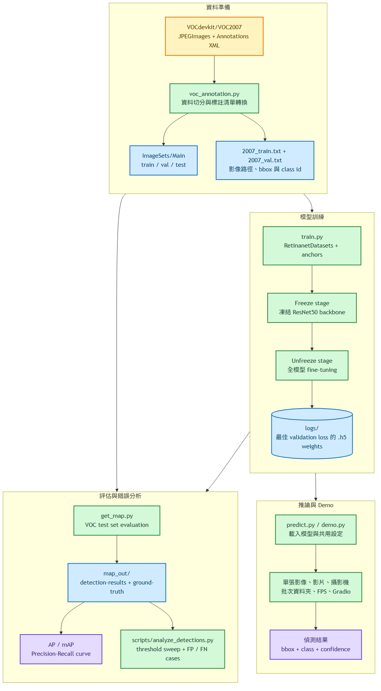

[檢視 Mermaid 原始檔](docs/diagrams/readme_01_flowchart_project_workflow.mmd)

### RetinaNet 模型架構

模型以 ResNet50 擷取 C3、C4、C5 特徵，透過 FPN 建立 P3 至 P7 多尺度特徵圖，再由所有尺度共用的 Regression Head 與 Classification Head 產生候選框偏移量及類別機率。推論階段最後執行 Anchor Decode、confidence filter 與 class-wise NMS。

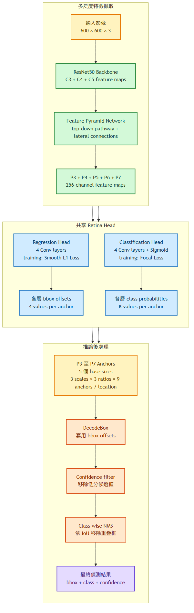

[檢視 Mermaid 原始檔](docs/diagrams/readme_02_flowchart_retinanet_architecture.mmd)

## 偵測類別

| 類別 | 說明 |
| --- | --- |
| `with_mask` | 正確配戴口罩 |
| `without_mask` | 未配戴口罩 |
| `mask_weared_incorrect` | 口罩配戴不正確 |

## Demo

### 多人場景偵測

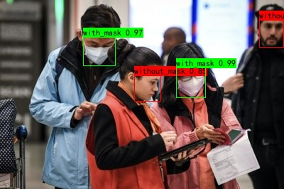

### Gradio 互動式 Demo

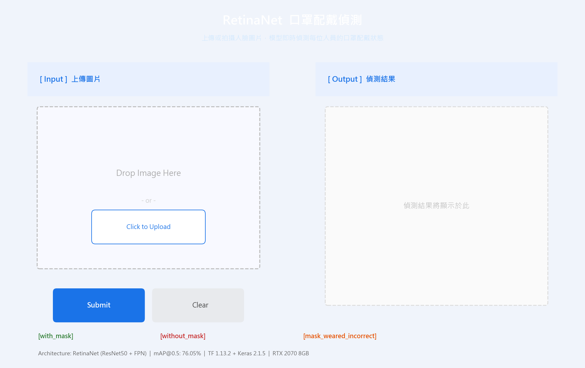

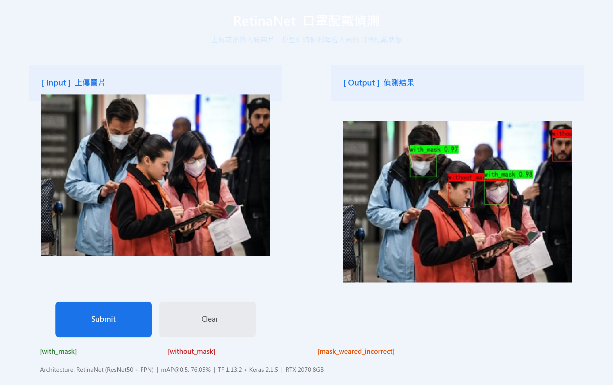

```bash
python demo.py --config configs/mask_retinanet.yaml
```

## 訓練成果

使用 [Face Mask Detection Dataset (Kaggle)](https://www.kaggle.com/datasets/andrewmvd/face-mask-detection) 訓練，評估指標為 mAP@0.5。

| 類別 | AP |
| --- | ---: |
| with_mask | 87.82% |
| without_mask | 71.48% |
| mask_weared_incorrect | 68.85% |
| **mAP** | **76.05%** |

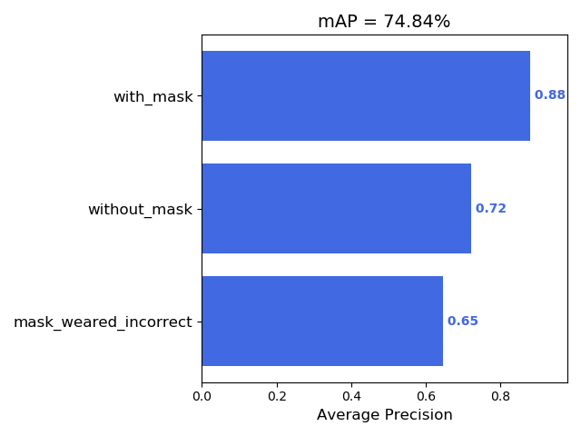

### Precision-Recall 曲線

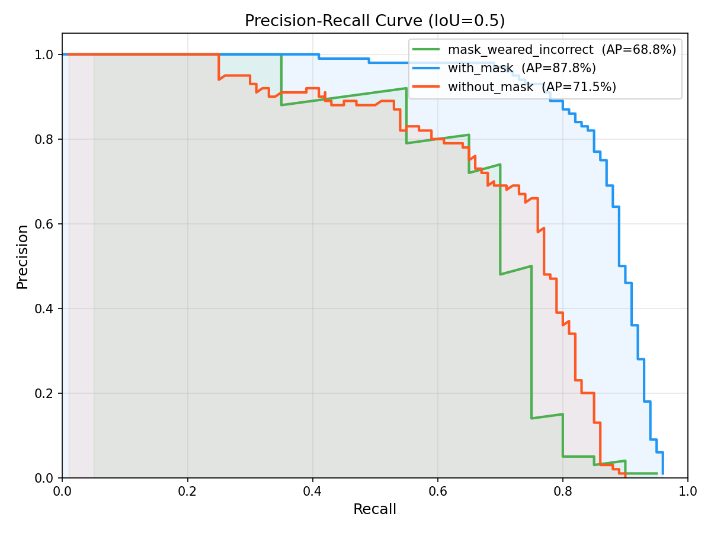

### 訓練曲線

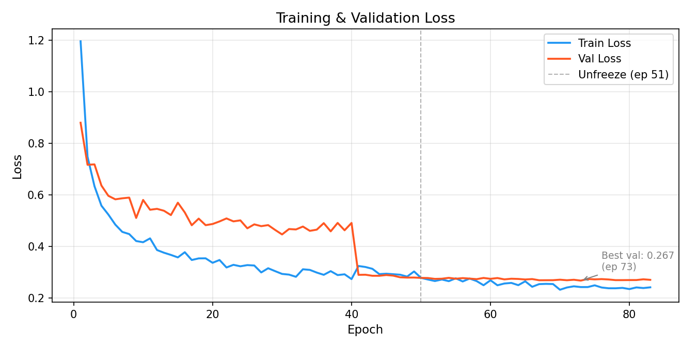

- Epoch 1-50：Freeze 階段，凍結 ResNet50 backbone，loss 快速下降
- Epoch 51-93：Unfreeze 階段，全模型訓練，最佳 validation loss 為 0.267

訓練硬體：NVIDIA RTX 2070 8GB。

## 快速開始

### 1. 建立環境

```bash
conda env create -f environment.yml
conda activate retinanet
```

或使用 pip：

```bash
conda create -n retinanet python=3.6
conda activate retinanet
pip install -r requirements.txt
```

本專案使用 TensorFlow 1.13.2 + Keras 2.1.5。若只使用 CPU，請將 `requirements.txt` 的 `tensorflow_gpu==1.13.2` 改成 `tensorflow==1.13.2`，並移除 CUDA/cuDNN 安裝需求。

Gradio demo 為選用功能：

```bash
pip install -r requirements-demo.txt
```

### 2. 下載權重

最佳模型權重 `ep083-loss0.241-val_loss0.267.h5` 建議放在 GitHub Releases，不直接 commit 到 repository。

下載後放到：

```text
logs/ep083-loss0.241-val_loss0.267.h5
```

如果檔名或位置不同，請修改 `configs/mask_retinanet.yaml` 的 `paths.inference_model_path`，或在執行時使用 `--weights` 覆寫。

### 3. 單張圖片推論

```bash
python predict.py ^
  --config configs/mask_retinanet.yaml ^
  --image figure/demo_input.jpg ^
  --output-image outputs/demo_result.jpg
```

輸出範例：

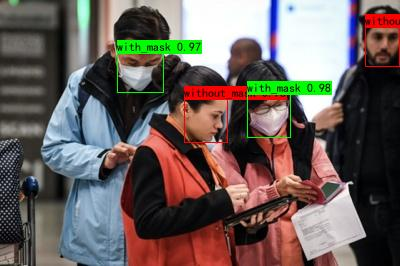

### 4. 啟動 Gradio Demo

```bash
python demo.py --config configs/mask_retinanet.yaml
```

### 5. 執行 Smoke Tests

不需要 GPU、資料集或模型權重：

```bash
python -m unittest discover tests
```

GitHub Actions 會在 push / pull request 時執行同一組 smoke tests。這組 CI 不訓練模型，也不載入 `.h5` 權重。

## 資料集準備

1. 下載 [Face Mask Detection Dataset](https://www.kaggle.com/datasets/andrewmvd/face-mask-detection)
2. 整理成 VOC 格式：

```text
VOCdevkit/
└── VOC2007/
    ├── Annotations/       # XML 標註檔
    ├── ImageSets/Main/    # train/val/test split txt
    └── JPEGImages/        # 原始圖片
```

3. 產生資料切分與訓練清單：

```bash
python voc_annotation.py --config configs/mask_retinanet.yaml
```

預設切分比例：

- train+val：80%
- test：20%
- train：train+val 中的 80%
- val：train+val 中的 20%
- random seed：0

## 訓練

訓練參數集中在 `configs/mask_retinanet.yaml`：

```bash
python train.py --config configs/mask_retinanet.yaml
```

常用覆寫範例：

```bash
python train.py ^
  --config configs/mask_retinanet.yaml ^
  --input-shape 600,600 ^
  --pretrained-weights model_data/resnet50_coco_best_v2.1.0.h5
```

預訓練權重可從 [keras-retinanet releases](https://github.com/fizyr/keras-retinanet/releases) 下載 `resnet50_coco_best_v2.1.0.h5`，並放到 `model_data/`。

目前設定預設 `save_best_only: true`，只保存 validation loss 最佳的 checkpoint，避免 `logs/` 產生大量權重檔。

## 推論模式

| mode | 指令範例 | 說明 |
| --- | --- | --- |
| `predict` | `python predict.py --image input.jpg --output-image outputs/result.jpg` | 單張圖片推論 |
| `predict` | `python predict.py` | 互動式輸入圖片路徑 |
| `video` | `python predict.py --mode video --source 0` | 攝影機即時偵測 |
| `video` | `python predict.py --mode video --source video.mp4 --save outputs/out.avi` | 影片偵測並儲存 |
| `fps` | `python predict.py --mode fps --fps-image figure/demo_input.jpg` | 測試推論速度 |
| `dir_predict` | `python predict.py --mode dir_predict --input img/ --output outputs/img_out/` | 批次偵測資料夾 |

## 評估 mAP

```bash
python get_map.py --config configs/mask_retinanet.yaml
```

常用覆寫範例：

```bash
python get_map.py ^
  --config configs/mask_retinanet.yaml ^
  --weights logs/ep083-loss0.241-val_loss0.267.h5 ^
  --min-overlap 0.5
```

輸出會放在 `map_out/`，包含 detection results、ground truth、PR curve 與 AP/mAP 結果。

終端輸出範例：

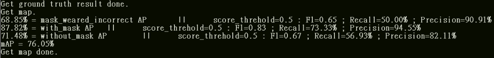

## 錯誤分析與 Threshold Tuning

完成 mAP 評估後，可以直接解析 `map_out/`，不需要重新載入模型。

產生不同 confidence threshold 下的 precision / recall / F1：

```bash
python scripts/analyze_detections.py threshold-sweep ^
  --map-out map_out ^
  --thresholds 0.1,0.2,0.3,0.4,0.5,0.6,0.7,0.8,0.9 ^
  --output analysis/threshold_sweep.csv
```

產生 false positive / false negative 清單：

```bash
python scripts/analyze_detections.py errors ^
  --map-out map_out ^
  --threshold 0.5 ^
  --output analysis/error_cases.csv
```

若本機有原始圖片，也可以輸出錯誤案例圖：

```bash
python scripts/analyze_detections.py errors ^
  --map-out map_out ^
  --threshold 0.5 ^
  --images-dir VOCdevkit/VOC2007/JPEGImages ^
  --render-dir analysis/error_images
```

更多說明見 [docs/error_analysis.md](docs/error_analysis.md)。

## 權重 Release

`.h5` 權重不建議 commit 到 repository。建立 GitHub Release 前可先產生含 SHA256 的 release notes：

```bash
python scripts/prepare_release.py ^
  --weights logs/ep083-loss0.241-val_loss0.267.h5 ^
  --output analysis/release_notes.md
```

更多說明見 [docs/release_checklist.md](docs/release_checklist.md)。

## 環境重現

本專案是 TensorFlow 1.x 舊版 stack，建議用 conda 隔離。Docker/CUDA 10.0 參考流程見 [docs/environment.md](docs/environment.md)。

## 重要設定

| 設定 | 預設值 | 說明 |
| --- | --- | --- |
| `model.input_shape` | `[600, 600]` | 訓練與推論必須一致 |
| `model.anchors_size` | `[32, 64, 128, 256, 512]` | FPN 各層 anchor 基礎大小 |
| `model.confidence` | `0.5` | 一般推論信心度門檻 |
| `model.nms_iou` | `0.3` | 一般推論 NMS IoU 門檻 |
| `evaluation.confidence` | `0.01` | mAP 評估時保留更多候選框 |
| `evaluation.nms_iou` | `0.5` | mAP 評估用 NMS IoU |
| `training.freeze_epoch` | `50` | backbone 凍結訓練 epoch |
| `training.unfreeze_epoch` | `100` | 全模型訓練 epoch 上限 |

## FPN Anchor 設計

RetinaNet 使用 FPN 在 P3-P7 五個解析度層產生 anchor，每層使用 3 個 scale 和 3 個 ratio，共 9 個 anchor。這讓模型能處理不同大小的人臉。

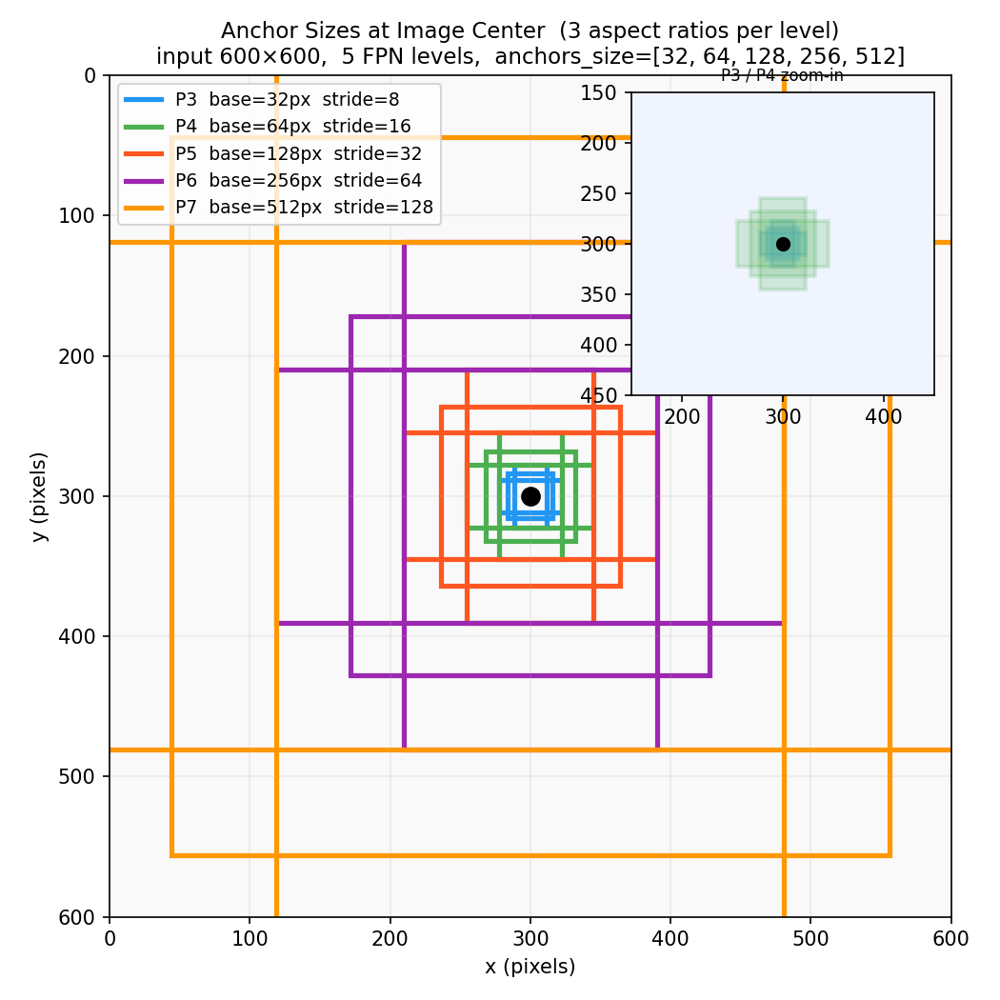

此圖可用以下指令重新產生（不需要 GPU 或權重）：

```bash
python vision_for_anchors.py --level 4 --output figure/anchor_distribution.png
```

## 類別不平衡與 Focal Loss

| 類別 | 訓練集數量 | 比例 |
| --- | ---: | ---: |
| with_mask | 2,994 | 77.6% |
| without_mask | 717 | 18.6% |
| mask_weared_incorrect | 145 | 3.8% |

資料集中 `with_mask` 與 `mask_weared_incorrect` 數量相差超過 20 倍。RetinaNet 使用 Focal Loss 降低易分類樣本的權重，使模型更專注於少數類別與困難樣本。

```math
FL(p_t) = -\alpha_t (1 - p_t)^\gamma \log(p_t)
```

## 專案結構

```text
RetinaNet/
├── .github/workflows/
│   └── smoke-tests.yml          # GitHub Actions smoke tests
├── configs/
│   └── mask_retinanet.yaml      # 共用設定檔
├── docs/
│   ├── environment.md           # Conda/Docker 環境說明
│   ├── error_analysis.md        # 錯誤分析與 threshold tuning
│   └── release_checklist.md     # GitHub Release 權重流程
├── nets/
│   ├── resnet.py                # ResNet50 backbone
│   ├── retinanet.py             # RetinaNet 模型架構
│   └── retinanet_training.py    # Focal Loss / Smooth L1 Loss
├── utils/
│   ├── anchors.py               # Anchor 生成
│   ├── callbacks.py             # 訓練 callbacks
│   ├── config.py                # 設定檔讀取工具
│   ├── dataloader.py            # 資料讀取與 augmentation
│   ├── utils_bbox.py            # BBox decode / NMS
│   ├── utils_map.py             # mAP 計算
│   └── utils.py                 # 通用工具
├── model_data/
│   └── mask_classes.txt         # 類別名稱
├── figure/                      # README 展示圖片
├── train.py                     # 訓練入口
├── predict.py                   # 推論入口
├── get_map.py                   # mAP 評估入口
├── voc_annotation.py            # VOC 資料切分與訓練清單產生
├── retinanet.py                 # 推論封裝類別
├── summary.py                   # 印出網路結構與層 index
├── vision_for_anchors.py        # FPN anchor 分布視覺化
├── scripts/
│   ├── analyze_detections.py    # FP/FN 分析與 threshold sweep
│   └── prepare_release.py       # 權重 release notes 產生器
├── demo.py                      # Gradio demo
├── tests/                       # 不需權重的 smoke tests
├── Dockerfile
├── environment.yml
├── requirements-demo.txt
└── requirements.txt
```

## GitHub 上傳注意事項

以下內容不建議 commit：

- `logs/`：訓練 checkpoint 與 TensorBoard log
- `VOCdevkit/` 中的圖片與 XML 標註
- `model_data/*.h5`：預訓練權重
- `model_data/*.ttf`：本機字型
- `map_out/`、`outputs/`、`img_out/`：推論與評估輸出

最佳模型權重請放到 GitHub Releases，README 中保留下載說明即可。

## 致謝與參考

- 模型架構與訓練流程參考 [bubbliiiing/retinanet-keras](https://github.com/bubbliiiing/retinanet-keras)（MIT License），在此基礎上完成以下改進：
  - 以 `configs/mask_retinanet.yaml` 集中管理模型、路徑、訓練與評估參數
  - 訓練、推論、mAP 評估全面 CLI 化，支援參數覆寫
  - 新增 FP/FN 錯誤分析與 confidence threshold sweep 工具（`scripts/analyze_detections.py`）
  - 新增 Gradio 互動式 demo 與自訂 UI
  - 新增不需 GPU/權重的 smoke tests 與 GitHub Actions CI
  - 新增權重 release 流程（SHA256 release notes 產生器）與 Docker 環境
- RetinaNet 論文：[Focal Loss for Dense Object Detection](https://arxiv.org/abs/1708.02002)
- 資料集：[Face Mask Detection Dataset (Kaggle)](https://www.kaggle.com/datasets/andrewmvd/face-mask-detection)
- ResNet50 COCO 預訓練權重：[fizyr/keras-retinanet](https://github.com/fizyr/keras-retinanet)
