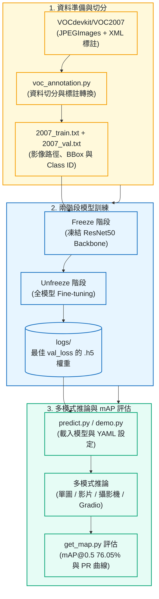
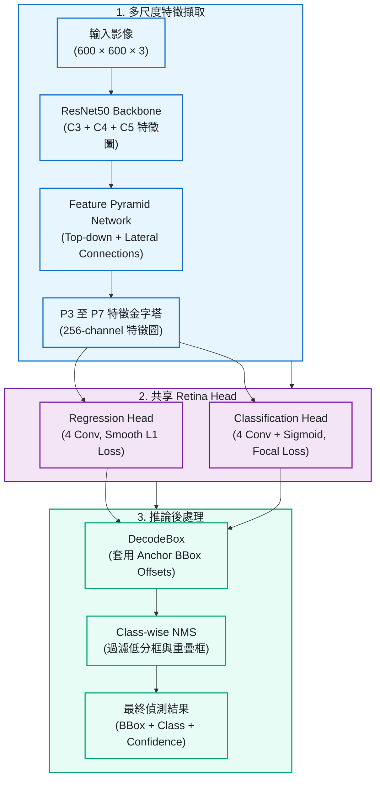
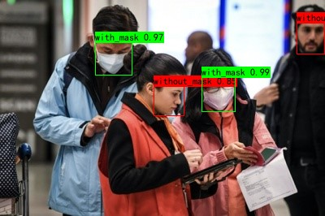
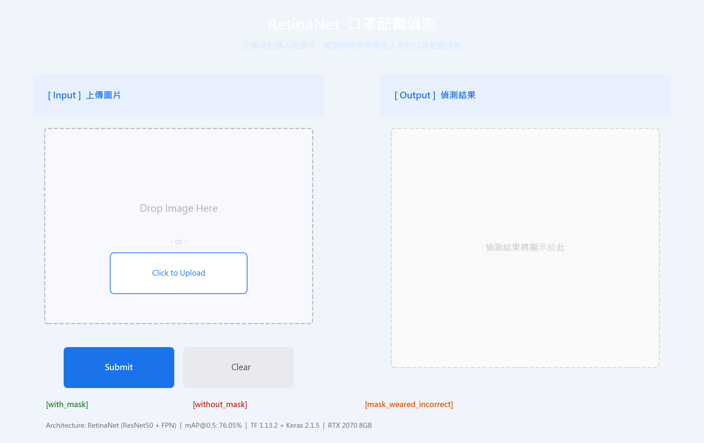
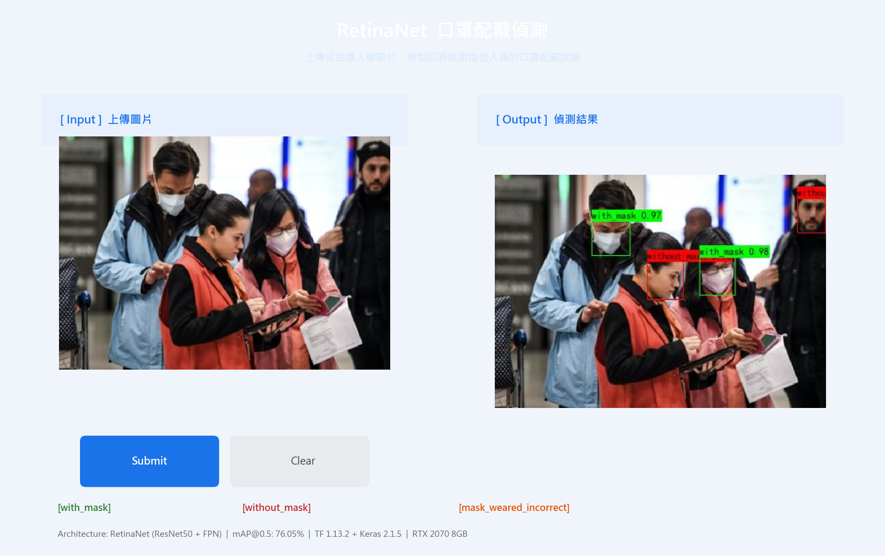
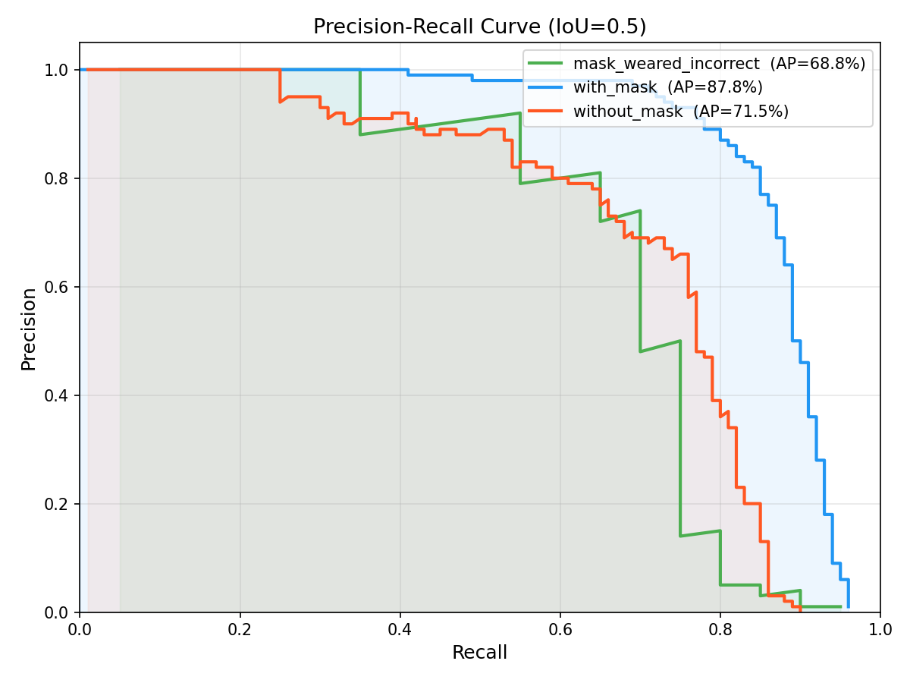
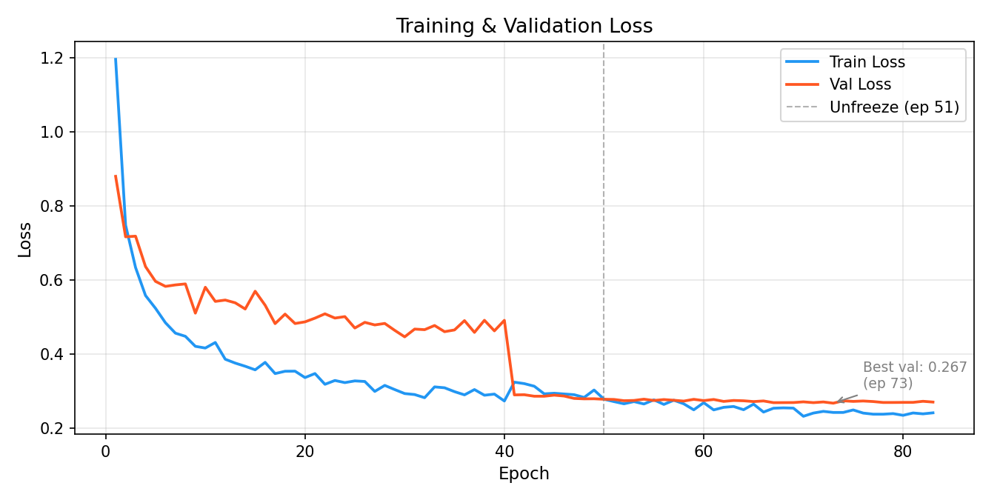

# retinanet-face-mask-detection

[](https://github.com/kuotunyu/retinanet-face-mask-detection/actions/workflows/tests.yml)


[](LICENSE)

本專案實作基於 **RetinaNet (ResNet50 + FPN)** 之口罩配戴狀態物件偵測 (Object Detection) 系統：針對包含正確配戴 (`with_mask`)、未配戴 (`without_mask`) 與配戴不正確 (`mask_weared_incorrect`) 進行三類別辨識。採用 Focal Loss 解決前景極度不平衡問題，提供 VOC 標註轉換、Freeze/Unfreeze 兩階段訓練、mAP@0.5 評估 (達到 **76.05%**)、多模式推論 (單圖/影片/攝影機) 與 Gradio 互動式 Web UI Demo。

---

## 系統設計與關鍵特性

1. **RetinaNet 雙頭架構與 Focal Loss**：
   結合 ResNet50 特徵擷取與 FPN (Feature Pyramid Network) 多尺度特徵融合，使用 Focal Loss 解決正負樣本嚴重失衡。
2. **Freeze ➔ Unfreeze 兩階段訓練策略**：
   前 50 Epochs 凍結 Backbone 進行主體擬合，第 51 Epoch 後全模型微調 (Unfreeze Fine-tuning)，降低訓練初期梯度震盪。
3. **組態驅動 (YAML Config) 與全流程 CLI**：
   由 `configs/mask_retinanet.yaml` 統一管理 Anchor、輸入尺寸 (600×600) 與推論門檻，確保訓練、評估與 Demo 參數高度一致。
4. **完整評估與 Gradio Web UI Demo**：
   自動導出 Precision-Recall 曲線與各類別 AP/mAP，並支援 Gradio 介面即時推論與即時攝影機串流。

---

## 系統架構與 Pipeline

### 1. 端到端工作流程


```mermaid
%%{init: {'themeVariables': {'fontSize': '20px'}}}%%
flowchart TD
    subgraph Preparation ["1. 資料準備與切分"]
        direction LR
        Dataset["VOCdevkit/VOC2007<br/>(JPEGImages + XML 標註)"] --> Annotation["voc_annotation.py<br/>(資料切分與標註轉換)"] --> TrainLists["2007_train.txt + 2007_val.txt<br/>(影像路徑、BBox 與 Class ID)"]
    end

    subgraph Training ["2. 兩階段模型訓練"]
        direction LR
        TrainLists --> Freeze["Freeze 階段<br/>(凍結 ResNet50 Backbone)"] --> Unfreeze["Unfreeze 階段<br/>(全模型 Fine-tuning)"] --> Weights[("logs/<br/>最佳 val_loss 的 .h5 權重")]
    end

    subgraph Application ["3. 多模式推論與 mAP 評估"]
        direction LR
        Weights --> Inference["predict.py / demo.py<br/>(載入模型與 YAML 設定)"] --> Modes["多模式推論<br/>(單圖 / 影片 / 攝影機 / Gradio)"] --> Map["get_map.py 評估<br/>(mAP@0.5 76.05% 與 PR 曲線)"]
    end

    Preparation --> Training --> Application

    classDef prepStyle fill:#fff9db,stroke:#f59f00,stroke-width:2px,color:#212529
    classDef trainStyle fill:#e7f5ff,stroke:#1971c2,stroke-width:2px,color:#212529
    classDef appStyle fill:#e6fcf5,stroke:#0ca678,stroke-width:2px,color:#212529

    class Preparation,Dataset,Annotation,TrainLists prepStyle
    class Training,Freeze,Unfreeze,Weights trainStyle
    class Application,Inference,Modes,Map appStyle
```

### 2. RetinaNet (ResNet50 + FPN) 模型架構


```mermaid
%%{init: {'themeVariables': {'fontSize': '20px'}}}%%
flowchart TD
    subgraph Features ["1. 多尺度特徵擷取"]
        direction LR
        Input["輸入影像<br/>(600 × 600 × 3)"] --> Backbone["ResNet50 Backbone<br/>(C3 + C4 + C5 特徵圖)"] --> FPN["Feature Pyramid Network<br/>(Top-down + Lateral Connections)"] --> Pyramid["P3 至 P7 特徵金字塔<br/>(256-channel 特徵圖)"]
    end

    subgraph Heads ["2. 共享 Retina Head"]
        direction LR
        Pyramid --> Regression["Regression Head<br/>(4 Conv, Smooth L1 Loss)"] & Classification["Classification Head<br/>(4 Conv + Sigmoid, Focal Loss)"]
    end

    subgraph Postprocess ["3. 推論後處理"]
        direction LR
        Regression & Classification --> Decode["DecodeBox<br/>(套用 Anchor BBox Offsets)"] --> NMS["Class-wise NMS<br/>(過濾低分框與重疊框)"] --> Output["最終偵測結果<br/>(BBox + Class + Confidence)"]
    end

    Features --> Heads --> Postprocess

    classDef featStyle fill:#e7f5ff,stroke:#1971c2,stroke-width:2px,color:#212529
    classDef headStyle fill:#f3e5f5,stroke:#7b1fa2,stroke-width:2px,color:#212529
    classDef postStyle fill:#e6fcf5,stroke:#0ca678,stroke-width:2px,color:#212529

    class Features,Input,Backbone,FPN,Pyramid featStyle
    class Heads,Regression,Classification headStyle
    class Postprocess,Decode,NMS,Output postStyle
```

---

## 成果展示與 Demo

### 1. 多人真實場景偵測



### 2. Gradio 互動式 Web UI

| Gradio 初始介面 | Gradio 實測結果 |
|:---:|:---:|
|  |  |

---

## 訓練評測與 mAP 結果

使用 [Face Mask Detection Dataset (Kaggle)](https://www.kaggle.com/datasets/andrewmvd/face-mask-detection) 訓練，在 VOC test 集評估 mAP@0.5：

| 偵測類別 | AP (%) | 類別說明 |
|---|---:|---|
| **with_mask** | **87.82%** | 正確配戴口罩 |
| **without_mask** | 71.48% | 未配戴口罩 |
| **mask_weared_incorrect** | 68.85% | 口罩配戴不正確 |
| **mAP@0.5** | **76.05%** | **整體平均精確度** |

| Precision-Recall 曲線 | Loss 收斂曲線 |
|:---:|:---:|
|  |  |

- **Loss 收斂說明**：Epoch 1-50 (Freeze 階段) Loss 快速下降；Epoch 51-93 (Unfreeze 階段) validation loss 最佳收斂至 **0.267**。

---

## 快速開始

### 1. 建立 conda 環境與安裝套件

```bash
conda create -n retinanet python=3.6 -y
conda activate retinanet
pip install -r requirements.txt
pip install -r requirements-demo.txt  # 選用 Gradio
```

### 2. 單張圖片與 Gradio Demo 執行

```bash
# 1. 單張圖片推論
python predict.py --config configs/mask_retinanet.yaml --image figure/demo_input.jpg --output-image outputs/demo_result.jpg

# 2. 啟動 Gradio 互動式 Demo
python demo.py --config configs/mask_retinanet.yaml

# 3. 執行單元測試 (Smoke Tests, 無需 GPU)
python -m unittest discover tests
```

---

## 完整推論模式說明

| 執行 Mode | 指令範例 | 功能與說明 |
|---|---|---|
| `predict` | `python predict.py --image input.jpg --output-image out.jpg` | 單張圖片推論並輸出渲染視覺圖 |
| `video` | `python predict.py --mode video --source 0` | 攝影機即時串流偵測 |
| `video` | `python predict.py --mode video --source video.mp4 --save out.avi` | 影片檔案逐幀偵測並導出 |
| `fps` | `python predict.py --mode fps --fps-image input.jpg` | 測試純模型推論 FPS 速度 |
| `dir_predict` | `python predict.py --mode dir_predict --input img/ --output out/` | 批次整包資料夾偵測 |

---

## 專案結構

| 檔案 / 目錄 | 功能說明與職責 |
|---|---|
| `configs/mask_retinanet.yaml` | 全域組態設定檔 (路徑、Anchor、輸入尺寸 600×600) |
| `train.py` | 兩階段訓練腳本 (Freeze ➔ Unfreeze) |
| `predict.py` | 多模式推論主入口 (圖片/影片/攝影機/FPS/批次) |
| `get_map.py` | VOC 格式 mAP@0.5 評估腳本 |
| `voc_annotation.py` | VOC XML 標註解析與 80/20 資料分割 |
| `demo.py` | Gradio Web UI 互動展示介面 |
| `nets/` | ResNet50、FPN 與 Retina Head 網路架構實作 |

---

## 授權與聲明

本專案採 [MIT License](LICENSE)。數據集請依原 [Kaggle Face Mask Detection Dataset](https://www.kaggle.com/datasets/andrewmvd/face-mask-detection) 規範使用。
